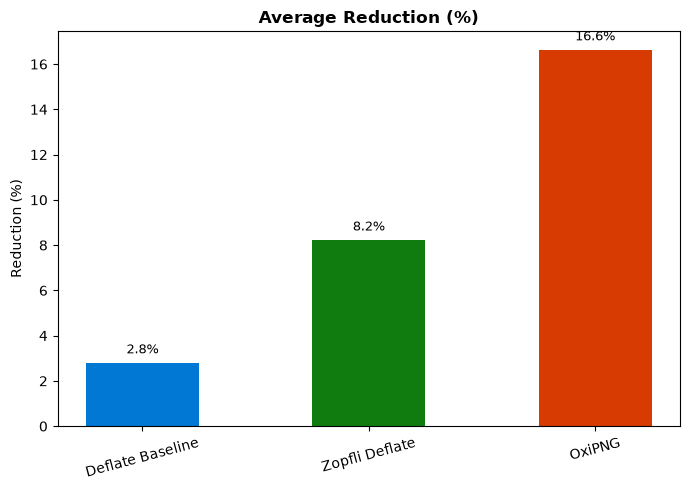
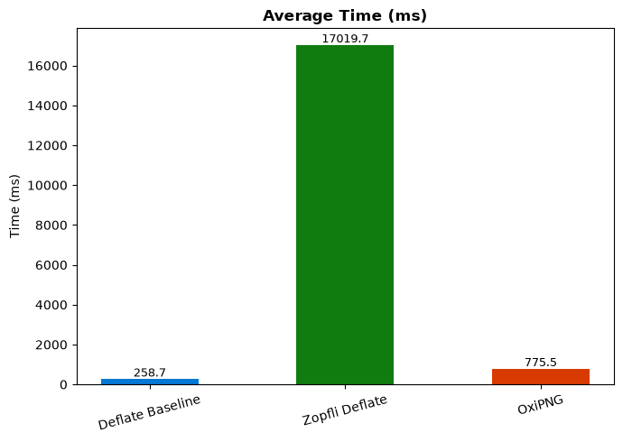

# PNG Compression Comparison System

**Studi Komparasi Tiga Algoritma Kompresi PNG Menggunakan Python Berbasis GUI Modern**

Aplikasi desktop berbasis Python untuk membandingkan efektivitas tiga algoritma kompresi gambar berformat PNG secara otomatis (batch). Aplikasi ini dirancang sebagai tugas akhir (UAS) Sistem Multimedia yang menitikberatkan pada perbandingan performa rasio kompresi dan waktu eksekusi.

---

## Demo (3 Menit)

Panduan cepat mendemonstrasikan aplikasi:
1. **Load Dataset:** Klik tombol **Browse Folder** lalu pilih folder `dataset/data1`.
2. **Run Comparison:** Klik tombol **📊 Run Comparison**. Pemindaian dan proses kompresi akan berjalan menggunakan *background thread* (UI tetap responsif).
3. **Lihat Ranking:** Setelah selesai, buka tab **Comparison Summary** atau **Ranking** untuk melihat pemenang seimbang.
4. **Lihat Chart:** Buka tab **Charts** untuk melihat visualisasi komparasi waktu dan reduksi antar algoritma.
5. **Export CSV:** Hasil analisis telah tersimpan secara otomatis di dalam direktori `outputs/reports/`.

---

## Dataset Eksperimen

Untuk menjaga keadilan dan objektivitas (*fairness*) komparasi algoritma, kami menggunakan 10 file sampel yang merepresentasikan keberagaman karakteristik PNG asli di dunia nyata. Semua sampel berada pada direktori `dataset/data1/`.

| File Name | Tipe Gambar | Ukuran Asli | Alasan Pemilihan |
| :--- | :--- | :--- | :--- |
| `foto1.png` | Photo | 643 KB | Memiliki banyak variasi piksel (warna kompleks). |
| `foto2.png` | Photo | 586 KB | Menguji kompresi pada gambar dengan tekstur natural. |
| `foto3.png` | Photo | 304 KB | Foto resolusi menengah sebagai pembanding kecepatan. |
| `ilustrasi1.png` | Illustration | 553 KB | Gambar vektor datar (warna solid yang seharusnya mudah dikompres). |
| `ilustrasi2.png` | Illustration | 773 KB | Ilustrasi kompleks dengan banyak gradasi. |
| `Screenshot 1.png` | Screenshot | 757 KB | Gambar layar UI, khas teks yang tajam. |
| `Screenshot 2.png` | Screenshot | 1.2 MB | Screenshot beresolusi sangat tinggi / 4K. |
| `Screenshot 3.png` | Screenshot | 494 KB | Screenshot biasa dengan jendela aplikasi. |
| `transparan1.png` | Transparency | 1.2 MB | Menguji bagaimana algoritma menangani *alpha channel* (latar bolong). |
| `transparan2.png` | Transparency | 1.3 MB | Gambar transparan dengan banyak tepi *anti-aliasing*. |

**Total:** 10 File | **Format:** `.png` | **Rentang:** 304 KB - 1.3 MB.

---

## Metodologi Eksperimen

*Ranking* algoritma dan penghitungan performa dihitung berdasarkan metodologi berikut:

### 1. Environment & Variabel Kontrol
- **Hardware:** OS Windows, Arsitektur x86_64. *(Catatan: Karena eksperimen berjalan di hardware lokal pengguna, hasil waktu/Time dapat bervariasi bergantung pada spesifikasi CPU/RAM).*
- **Software:** Python 3.11+, menggunakan *standard library* dan subprocess untuk *wrapper*.
- **Timeout Policy:** 
  - Zopfli: Batas maksimum 60 detik per file. Jika melebihi waktu ini, proses diputus dan gambar tidak dihitung (mencegah *infinite hang*).
  - OxiPNG: Batas maksimum 120 detik per file.
- **Iteration Run:** Setiap file dijalankan kompresi ulang *lossless* 1 kali per algoritma.

### 2. Balanced Score (Formula Peringkat)
Karena Deflate unggul di waktu namun lemah di reduksi ukuran, dan Zopfli sebaliknya, kami menciptakan **Balanced Score (0-100)**:

$$ \text{Balanced Score} = (0.5 \times \text{Normalized Reduction}) + (0.5 \times \text{Normalized Speed}) $$

- **Normalized Reduction:** Dicari menggunakan formula _Min-Max Scaling_ di mana penghematan ruang (Bytes) tertinggi mendapat skor 100.
- **Normalized Speed:** Waktu tercepat (Miliseconds) yang terukur mendapat skor 100, terlama mendapat 0.

---

## Keterbatasan Eksperimen (Threats to Validity)

Analisis akademik yang dilaporkan memiliki beberapa keterbatasan:
1. **Hardware Dependency:** Metrik kecepatan (*Fastest*) sangat bergantung pada kapabilitas *multithreading* prosesor mesin host saat itu. OxiPNG menggunakan multi-core, sedangkan Zopfli dan Deflate *single-thread*. 
2. **Timeout Bias:** Batasan waktu (*timeout*) 60 detik per file mungkin secara tidak adil mendiskualifikasi Zopfli pada *file* berukuran raksasa. 
3. **Dataset Size:** Jumlah 10 sampel dirasa cukup untuk memberikan gambaran dasar, tetapi tidak serta-merta mewakili rata-rata statistik yang sah untuk klaim global.
4. **OxiPNG External Binary:** Karena ditulis di Rust, ia dipanggil menggunakan metode `subprocess.Popen()`. Ada sedikit latensi *I/O startup* (~10ms) per panggilan file yang membebani metrik waktu OxiPNG dibandingkan modul *built-in* C milik Python.

---

## Latar Belakang & Landasan Teori

### 1. Kenapa Memilih 3 Algoritma Ini?
*   **Deflate Baseline (zlib):** Algoritma *standard library* Python yang dikompilasi di C. Cepat tapi standar. Sebagai *baseline* eksperimen.
*   **Zopfli (Google):** Melakukan pencarian *exhaustive* format Deflate. Unggul dalam mengecilkan ukuran (*Best Compression*) tetapi lambat karena memakan siklus CPU secara repetitif.
*   **OxiPNG (Rust):** Algoritma *optimizer* generasi baru yang mengeliminasi metadata (*chunk*) tak terpakai menggunakan iterasi *multithread*. Kompromi seimbang antara ukuran dan waktu.

### 2. Kenapa CustomTkinter?
Digunakan **Tkinter** bawaan dan di- *wrapper* dengan **CustomTkinter** agar:
* Sangat ringan (berbeda dari Electron/Node.js).
* Modern secara estetika (mendukung *Dark Mode*).
* Mampu direkayasa untuk menggunakan arsitektur *Main UI Thread* + *Background Worker Thread* sehingga komputasi OxiPNG/Zopfli yang ekstrem tidak menyebabkan antarmuka aplikasi menjadi *hang* atau *Not Responding*.

---

## Visualisasi Fitur

Diagram ini ditarik dari hasil uji komparasi terbaru (`deliverables/screenshots/`):

| Grafik Reduksi Ukuran File | Grafik Kecepatan Kompresi |
|:---:|:---:|
|  |  |

---

## Setup & Instalasi

### 1. Prasyarat
- **Python 3.11+**
- Virtual Environment (Opsional)

### 2. Cara Menginstal
```bash
# Clone & Navigasi
cd uas-kompresi-png

# Buat & Aktifkan Virtual Environment
python -m venv .venv
.venv\Scripts\activate   # Windows

# Instal semua dependensi
pip install -r requirements.txt
```

### 3. Eksternal Binary (OxiPNG)
Executable OxiPNG **sudah disediakan di repository** pada folder `tools/oxipng/oxipng.exe`. Anda tidak perlu mengunduh apa pun secara manual.

---

## Troubleshooting & Solusi

Jika penguji mendapati *error* selama menjalankan aplikasi:

| Problem / Gejala | Kemungkinan Penyebab | Solusi (*Fix*) |
|:---|:---|:---|
| `ModuleNotFoundError: No module named 'zopfli'` | Virtual environment belum diaktivasi atau dependensi belum diinstal. | Jalankan `.venv\Scripts\activate` lalu `pip install -r requirements.txt`. |
| OxiPNG tidak menghasilkan kompresi (*Error log*) | File `oxipng.exe` terhapus / terblokir *antivirus*. | Pastikan file ada di `tools/oxipng/oxipng.exe`. Cek *quarantine* antivirus. |
| Komparasi Zopfli terasa "stuck" (lama sekali) | Sifat asli Zopfli *exhaustive search*. Terutama pada dataset transparan. | Jangan klik paksa. Biarkan berjalan, batas *timeout* Zopfli (60s per file) akan otomatis memutus proses. |
| Grafik (*Chart*) Tidak Muncul | *Matplotlib GUI Backend* tidak disupport OS pengguna. | Aplikasi menyimpan versi *stateless* di folder `outputs/charts/`. Buka file tersebut secara manual. |
| Aplikasi tidak kompatibel (Error `compression._common`) | Konflik modul internal dengan Python versi 3.14 (Beta). | Issue ini sudah di- *patch*, pastikan kode Anda sejajar dengan *branch main* saat ini. |

---

## Struktur Proyek

```text
uas-kompresi-png/
├── src/                             # Source code aplikasi (UI, Compressor, Analisis)
├── dataset/                         # Kumpulan gambar sampel
├── outputs/                         # (Auto-generated) Hasil ekspor kompresi, CSV, Chart
├── deliverables/                    # Dokumen & aset statis pengerjaan presentasi
│   └── screenshots/                 # Gambar demo chart
├── tests/                           # Modul pengujian unit (128 cases)
└── tools/oxipng/                    # Binary statis (executable OxiPNG)
```

---

*Laporan ini dibuat sebagai bagian dari Tugas Akhir Sistem Multimedia Semester 6.*
